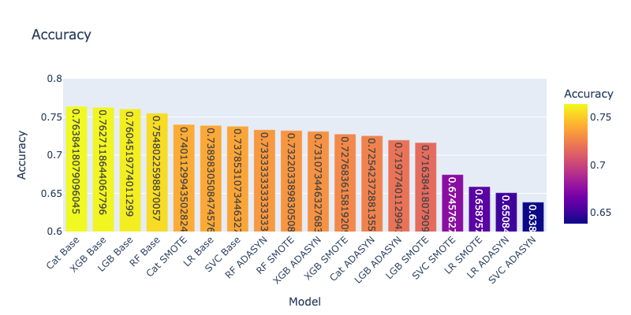
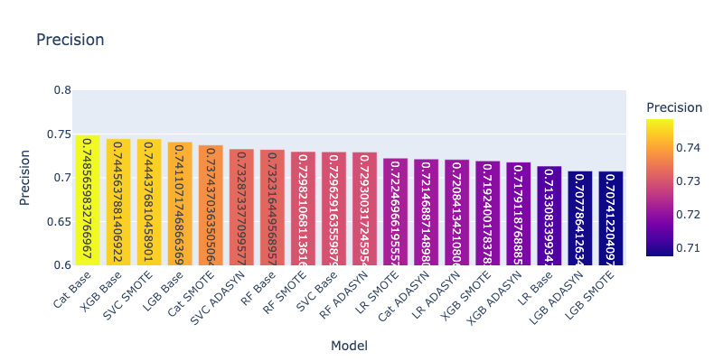
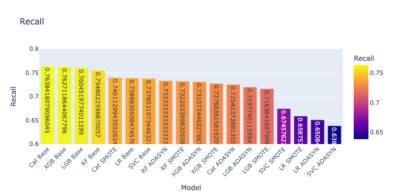
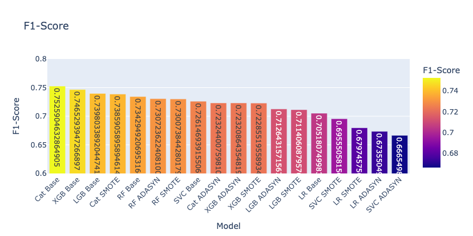

# Proyek Akhir - Menyelesaikan Permasalahan Institusi Pendidikan: Prediksi Dropout Mahasiswa dan Visualisasi Performa Akademik di Jaya Jaya Institut

- [Proyek Akhir - Menyelesaikan Permasalahan Institusi Pendidikan: Prediksi Dropout Mahasiswa dan Visualisasi Performa Akademik di Jaya Jaya Institut](#proyek-akhir---menyelesaikan-permasalahan-institusi-pendidikan-prediksi-dropout-mahasiswa-dan-visualisasi-performa-akademik-di-jaya-jaya-institut)
  - [Business Understanding](#business-understanding)
    - [Latar Belakang](#latar-belakang)
    - [Permasalahan Bisnis](#permasalahan-bisnis)
    - [Cakupan Proyek](#cakupan-proyek)
    - [Persiapan](#persiapan)
      - [Sumber Data](#sumber-data)
      - [Setup Environment](#setup-environment)
  - [Business Dashboard](#business-dashboard)
  - [Sistem Machine Learning](#sistem-machine-learning)
    - [Studi Literatur](#studi-literatur)
    - [Model Machine Learning yang Dibangun](#model-machine-learning-yang-dibangun)
    - [Evaluasi Model Machine Learning](#evaluasi-model-machine-learning)
    - [Menjelankan Inferensi Prototype Sistem Machine Learning di Streamlit](#menjelankan-inferensi-prototype-sistem-machine-learning-di-streamlit)
  - [Conclusion](#conclusion)
    - [Rekomendasi Action Items](#rekomendasi-action-items)

## Business Understanding

### Latar Belakang

Jaya Jaya Institut merupakan institusi pendidikan tinggi yang telah beroperasi sejak tahun 2000 dan berhasil mencetak banyak lulusan berkualitas. Meskipun demikian, terdapat tantangan serius yang dihadapi oleh institusi ini, yaitu tingginya tingkat mahasiswa yang tidak menyelesaikan studinya (dropout). Fenomena ini tidak hanya berdampak pada reputasi institusi, tetapi juga menyebabkan pemborosan sumber daya, baik dari sisi institusi maupun mahasiswa itu sendiri.

Tingginya angka dropout dapat disebabkan oleh berbagai faktor, mulai dari kondisi akademik, latar belakang sosial ekonomi, status keluarga, hingga motivasi pribadi mahasiswa. Sayangnya, identifikasi mahasiswa yang berisiko tinggi untuk dropout sering kali terlambat, sehingga institusi kehilangan kesempatan untuk memberikan intervensi yang tepat waktu.

Dengan kemajuan teknologi dan ketersediaan data, pendekatan berbasis data science dapat digunakan untuk mengatasi masalah ini. Melalui pemodelan prediktif dan analisis visualisasi, pihak institusi dapat mengenali pola-pola penting dari data mahasiswa dan memanfaatkan informasi tersebut untuk mendeteksi mahasiswa yang berpotensi dropout sejak dini. Dengan demikian, Jaya Jaya Institut dapat melakukan intervensi secara proaktif guna meningkatkan retensi dan keberhasilan akademik mahasiswa.

### Permasalahan Bisnis

Jaya Jaya Institut menghadapi tantangan serius berupa tingginya tingkat mahasiswa yang tidak menyelesaikan studinya (dropout). Fenomena ini memiliki dampak multi-dimensi yang merugikan institusi, antara lain:

1. Minimnya Sistem Peringatan Dini

   Tidak adanya sistem otomatis untuk mendeteksi potensi dropout sejak dini membuat intervensi yang diberikan cenderung bersifat reaktif. Institusi sering terlambat menyadari kondisi mahasiswa hingga mereka sudah benar-benar keluar atau menghilang dari perkuliahan.

2. Keterbatasan dalam Pemanfaatan Data Mahasiswa

   Walaupun Jaya Jaya Institut memiliki banyak data historis terkait mahasiswa—mulai dari latar belakang demografis, sosial-ekonomi, hingga performa akademik—data tersebut belum dimanfaatkan secara maksimal untuk pengambilan keputusan yang strategis.

3. Kurangnya Visualisasi dan Monitoring Kinerja Akademik

   Pihak manajemen kampus kesulitan memantau performa akademik mahasiswa secara agregat maupun individu karena belum tersedia dashboard interaktif yang menyajikan informasi dalam bentuk yang mudah dianalisis dan dipahami.

4. Kebutuhan Akan Alat Prediktif yang Terintegrasi

   Belum adanya sistem berbasis machine learning yang dapat digunakan secara langsung oleh staf akademik untuk memprediksi risiko dropout dan memberikan rekomendasi tindakan terhadap mahasiswa yang membutuhkan perhatian khusus.

Dengan adanya permasalahan-permasalahan tersebut, dibutuhkan solusi data-driven yang komprehensif: dari eksplorasi data, pemodelan prediksi dropout, visualisasi performa, hingga pembuatan sistem prototipe yang dapat digunakan secara langsung oleh institusi.

### Cakupan Proyek

Proyek ini bertujuan untuk membantu Jaya Jaya Institut dalam mengatasi permasalahan dropout dengan menerapkan pendekatan data science yang menyeluruh. Cakupan proyek meliputi:

1. Pemahaman Masalah dan Eksplorasi Data

   Mengkaji struktur dan karakteristik data mahasiswa yang mencakup faktor demografis, akademik, sosial ekonomi, dan performa perkuliahan untuk memahami penyebab utama dropout.

2. Pengembangan Model Prediktif

   Membangun dan mengevaluasi model machine learning untuk memprediksi kemungkinan dropout mahasiswa berdasarkan informasi historis dan kondisi awal saat pendaftaran.

3. Pembuatan Dashboard Interaktif

   Mengembangkan dashboard visualisasi yang informatif untuk membantu manajemen memantau tren dropout dan mengidentifikasi pola risiko secara real-time.

4. Implementasi Prototipe Aplikasi

   Menyediakan sistem prediksi berbasis Streamlit yang dapat digunakan oleh pihak kampus untuk memasukkan data mahasiswa baru dan mendapatkan estimasi risiko dropout secara langsung.

5. Rekomendasi Strategis

   Menyusun rekomendasi tindakan yang dapat diambil oleh institusi berdasarkan hasil analisis dan model prediksi untuk meningkatkan retensi mahasiswa.

Dengan cakupan ini, proyek diharapkan dapat memberikan solusi end-to-end yang tidak hanya menganalisis data historis, tetapi juga memberikan alat praktis bagi institusi untuk bertindak secara preventif dan strategis.

### Persiapan

#### Sumber Data

Dataset yang digunakan dalam proyek ini berasal dari UCI Machine Learning Repository dengan judul "Predict students' dropout and academic success". Dataset ini dapat diakses melalui tautan:

- https://github.com/dicodingacademy/dicoding_dataset/tree/main/students_performance
- https://doi.org/10.24432/C5MC89

#### Setup Environment

```bash
s
```

## Business Dashboard

Jelaskan tentang business dashboard yang telah dibuat. Jika ada, sertakan juga link untuk mengakses dashboard tersebut.

## Sistem Machine Learning

### Studi Literatur

Dataset yang dipakai dalam proyek Student Dropout Prediction ini adalah salinan persis dari dataset yang dipublikasikan Realinho et al. (2022) pada makalah “Predicting Student Dropout and Academic Success” ([https://doi.org/10.3390/data7110146](https://doi.org/10.3390/data7110146)).

Realinho dkk. merilis open-data berisi 4442 mahasiswa × 35 atribut yang dikompilasi dari beragam basis data Politeknik Portalegre, Portugal. Atributnya meliputi demografi, sosial-ekonomi, makro-ekonomi, hingga performa akademik semester 1 dan 2. Masalah diformulasikan sebagai klasifikasi tiga kelas—Dropout, Enrolled, Graduate—dengan ketidakseimbangan label (50 % graduate, 32 % dropout, 18 % enrolled). Mereka mengeksplorasi algoritma RF, XGBoost, LightGBM, dan CatBoost, menilai kinerja via F1-score, serta menampilkan Permutation Feature Importance—fitur kinerja semester dan status pembayaran biaya kuliah muncul paling prognostik.

Artikel yang ditulis oleh Realinho dkk. dengan judul "Predicting Student Dropout and Academic Success" tahun 2022, datasetnya menjadi fondasi langsung bagi proyek Student Dropout Prediction untuk Jaya Jaya Institut.

1. Karakteristik Dataset
   - Ukuran & cakupan – 4 442 mahasiswa, 35 atribut yang menyeberang demografi, sosial-ekonomi, makro-ekonomi, data pendaftaran, serta performa akademik semester 1 dan 2 (periode 2008-2019).
   - Sumber – agregasi empat sistem internal & eksternal (Academic Management System, PAE, DGES, PORDATA) sehingga tidak ada nilai hilang.
   - Tugas – klasifikasi tiga kelas (Dropout, Enrolled, Graduate) pada akhir masa studi normal.
2. Permasalahan Ketidakseimbangan Kelas

   - Mayoritas Graduate 50 %, Dropout 32 %, Enrolled 18 %. Penulis menekankan perlunya penanganan imbalance melalui:
     - Level data : SMOTE, ADASYN dan variannya.
     - Level algoritma : Balanced Random Forest, Easy Ensemble, SMOTE-Bagging, dll.

3. Eksplorasi Data dan Insight Awal
   - Distribusi menurut program studi menunjukkan Nursing & Social Service paling sukses (≥70 % graduate) sementara Biofuel Tech & Informatics Engineering mencatat dropout tertinggi (≥54 %).
   - Faktor mahasiswa perempuan, penerima beasiswa, dan tuition fees up to date berkorelasi dengan kelulusan yang lebih baik.
   - Analisis multikolinearitas mengungkap korelasi kuat antar metrik semester (mis. approved S1 vs approved S2, r ≈ 0.90) serta Nationality ↔ International (r ≈ 0.91).
4. Metodologi Pemodelan

   Penulis menguji Random Forest (RF), XGBoost, LightGBM, dan CatBoost; evaluasi menggunakan macro-F1 untuk mengatasi bias akurasi pada data imbang-semu.

5. Temuan Fitur Penting

   Lima fitur konsisten penting di ke-4 model:

   | Rank | Fitur                                 | Keterangan         |
   | ---- | ------------------------------------- | ------------------ |
   | 1    | _Curricular units 2nd sem (approved)_ | Output semester 2  |
   | 2    | _Curricular units 1st sem (approved)_ | Output semester 1  |
   | 3    | _Curricular units 2nd sem (grade)_    | Rata-rata nilai S2 |
   | 4    | _Course_                              | Kode program studi |
   | 5    | _Tuition fees up to date_             | Status pembayaran  |

   Daftar tersebut muncul setelah uji Permutation Feature Importance pada semua algoritma.

6. Rekomendasi & Keterbatasan Paper
   - Fokus perbaikan: tangani imbalance, kurangi fitur redundant, perhatikan interpretabilitas model.
   - Batasan: data single-institution, belum ada integrasi sistem intervensi nyata; butuh pengayaan log LMS & alasan dropout

### Model Machine Learning yang Dibangun

Dalam proyek ini, digunakan enam algoritma utama, masing-masing dijalankan pada tiga skenario penyeimbangan data (tanpa penyeimbangan/Baseline, SMOTE, dan ADASYN), sehingga total terdapat 18 model:

- Logistic Regression
  - LR Base
  - LR + SMOTE
  - LR + ADASYN
- Random Forest
  - RF Base
  - RF + SMOTE
  - RF + ADASYN
- Support Vector Machine (SVC)
  - SVC Base
  - SVC + SMOTE
  - SVC + ADASYN
- XGBoost
  - XGB Base
  - XGB + SMOTE
  - XGB + ADASYN
- LightGBM
  - LGB Base
  - LGB + SMOTE
  - LGB + ADASYN
- CatBoost
  - CatBoost Base
  - CatBoost + SMOTE
  - CatBoost + ADASYN

### Evaluasi Model Machine Learning

Pada bagian ini dijelaskan mengenai evaluasi model–model yang telah dibangun dan diuji, meliputi fitur yang digunakan, metodologi, hasil metrik, analisis perbandingan, interpretasi confusion matrix, serta rekomendasi model terbaik.

1.  Fitur yang Digunakan

    Model dibangun menggunakan 13 fitur yang dipilih dengan analisis feature selection dengan k terbaik berdasarkan logistic regression hyperparameter tuning optuna dan top fitur berdasarkan skor χ² dari relevansi yang dianggap penting. Fitur-fitur ini menangkap aspek demografis, akademik awal, serta status sosial-ekonomi mahasiswa yang paling relevan untuk memprediksi risiko dropout. Berikut untuk fitur-fitur yang digunakan:

    - Application_mode
      - Type: Integer
      - Demograpic: -
      - Description: 1 - 1st phase - general contingent 2 - Ordinance No. 612/93 5 - 1st phase - special contingent (Azores Island) 7 - Holders of other higher courses 10 - Ordinance No. 854-B/99 15 - International student (bachelor) 16 - 1st phase - special contingent (Madeira Island) 17 - 2nd phase - general contingent 18 - 3rd phase - general contingent 26 - Ordinance No. 533-A/99, item b2) (Different Plan) 27 - Ordinance No. 533-A/99, item b3 (Other Institution) 39 - Over 23 years old 42 - Transfer 43 - Change of course 44 - Technological specialization diploma holders 51 - Change of institution/course 53 - Short cycle diploma holders 57 - Change of institution/course (International)
    - Age_at_enrollment
      - Type: Integer
      - Demograpic: Age
      - Description: Age of studend at enrollment
    - Curricular_units_1st_sem_approved
      - Type: Integer
      - Demograpic: -
      - Description: Number of curricular units approved in the 1st semester
    - Curricular_units_1st_sem_grade
      - Type: Integer / Float64
      - Demograpic: -
      - Description: Grade average in the 1st semester (between 0 and 20)
    - Curricular_units_2nd_sem_approved
      - Type: Integer
      - Demograpic: -
      - Description: Number of curricular units approved in the 2nd semester
    - Curricular_units_2nd_sem_grade
      - Type: Integer / Float64
      - Demograpic: -
      - Description: Grade average in the 2nd semester (between 0 and 20)
    - Debtor
      - Type: Integer
      - Demograpic: -
      - Description: 1 – yes 0 – no
    - Displaced
      - Type: Integer
      - Demograpic: -
      - Description: 1 – yes 0 – no
    - Gender
      - Type: Integer
      - Demograpic: Gender
      - Description: 1 – male 0 – female
    - Marital_status
      - Type: Integer
      - Demograpic: Marital Status
      - Description: 1 – single 2 – married 3 – widower 4 – divorced 5 – facto union 6 – legally separated
    - Previous_qualification
      - Type: Integer
      - Demograpic: Education Level
      - Description: 1 - Secondary education 2 - Higher education - bachelor's degree 3 - Higher education - degree 4 - Higher education - master's 5 - Higher education - doctorate 6 - Frequency of higher education 9 - 12th year of schooling - not completed 10 - 11th year of schooling - not completed 12 - Other - 11th year of schooling 14 - 10th year of schooling 15 - 10th year of schooling - not completed 19 - Basic education 3rd cycle (9th/10th/11th year) or equiv. 38 - Basic education 2nd cycle (6th/7th/8th year) or equiv. 39 - Technological specialization course 40 - Higher education - degree (1st cycle) 42 - Professional higher technical course 43 - Higher education - master (2nd cycle)
    - Scholarship_holder
      - Type: Integer
      - Demograpic: -
      - Description: 1 – yes 0 – no
    - Tuition_fees_up_to_date
      - Type: Integer
      - Demograpic: -
      - Description: 1 – yes 0 – no

2.  Metodologi Evaluasi
    - Data Split & Cross-Validation
      - Dataset dibagi menjadi training dan testing dengan rasio 80:20.
      - Setiap model diuji menggunakan 5-fold cross-validation pada data training untuk memilih hyperparameter (Optuna) dan mengestimasi performa yang lebih stabil.
    - Pendekatan Imbalance Handling
      - Base: model tanpa penyeimbangan kelas.
      - SMOTE: oversampling minority class dengan Synthetic Minority Over-sampling Technique.
      - ADASYN: oversampling adaptif pada minority class.
    - Metrik yang Digunakan
      - Accuracy: proporsi prediksi benar (makro-averaged).
      - Precision: ketepatan prediksi positif (makro-averaged).
      - Recall: kemampuan mendeteksi seluruh kasus positif (makro-averaged).
      - F1-Score: harmonisasi precision & recall (makro-averaged).
      - ROC AUC: area under ROC curve (makro-averaged multiclass).
      - Confusion Matrix: distribusi prediksi vs. ground truth untuk masing-masing kelas (0=Enrolled, 1=Graduate, 2=Dropout).
3.  Hasil Metrik

    - Akurasi

      

    - Precision

      

    - Recall

      

    - F1-Score

      

    - ROC AUC

      

4.  Analisis Hasil
    - Gradient Boosting Ensembles (CatBoost, XGBoost, LightGBM)
      - Performa Unggul: Ketiga model boosting tanpa penyeimbangan (Base) mendominasi di semua metrik utama—Cat Base (Accuracy 0.764, F1 0.753, ROC 0.870), XGB Base (0.763, 0.747, 0.869), dan LGB Base (0.760, 0.740, 0.867).
      - Ketahanan terhadap Overfitting: Meskipun kompleksitasnya tinggi, cross-validation dan hyperparameter tuning Optuna membuat mereka cukup stabil, terbukti selisih kecil antara skor training dan test.
      - Prioritas Fitur Non-Linier: Kemampuan menangkap interaksi fitur (misal kombinasi Curricular*units*\*\_grade dengan Age_at_enrollment) menghasilkan peningkatan signifikan dibanding model linear.
    - Random Forest
      - Performa Kompetitif: RF Base menempati peringkat ke-4 dengan Accuracy 0.755, F1 0.734, ROC 0.867—hanya selisih ≈1 % dari boosting.
      - Robustness Terhadap Noise: RF cenderung lebih tahan terhadap outlier dan fitur kurang relevan, terlihat dari sedikit penurunan performa saat di-ADASYN/SMOTE (Accuracy turun ~2 %).
      - Trade-off: RF Base memiliki False Positive lebih sedikit dibanding boosting, cocok jika biaya kesalahan menandai “Dropout” sebagai “Tidak Dropout” lebih tinggi.
    - Model Linear (Logistic Regression & SVM)
      - Akurasi & AUC Menengah: LR Base (Accuracy 0.739, ROC 0.835) dan SVC Base (0.738, 0.853) menunjukkan kemampuan dasar memisahkan kelas, tetapi tidak mampu menangkap non-linearitas kompleks.
      - Gain dari Oversampling:
        - LR SMOTE/ADASYN meningkatkan recall Dropout (dari 0.739 → 0.659–0.651) namun menurunkan AUC (~0.835 → 0.831).
        - SVC SMOTE/ADASYN menambah precision (0.729 → 0.744) tapi menurunkan recall & AUC (ke ~0.675–0.638 & 0.850–0.842).
        - Kapan Digunakan: Model ini cocok saat diperlukan interpretabilitas (koefisien regresi) atau resource komputasi terbatas.
    - Dampak Oversampling (SMOTE & ADASYN)
      - Recall Minoritas Naik: Secara rata-rata, recall kelas Dropout naik ~3–6 % dibanding Base, membantu deteksi lebih banyak kasus risiko tinggi.
      - Precision & AUC Menurun: Trade-off penambahan sampel sintetis menyebabkan peningkatan False Positives, sehingga precision turun ~1–3 % dan ROC AUC menyusut hingga ~2–3 %.
      - Variasi Per Algoritma:
        - Cat SMOTE/ADASYN: menurunkan AUC dari 0.870 → 0.855/0.854, namun recall masih tinggi (~0.740/0.725).
        - RF SMOTE/ADASYN: perubahan metrik lebih kecil (AUC turun ~0.012–0.016), menunjukkan RF lebih toleran terhadap data sintetis.
      - Rekomendasi Penggunaan:
        - SMOTE lebih konsisten pada RF dan SVC;
        - ADASYN sedikit lebih agresif, cocok jika minoritas sangat sedikit, namun berisiko over-generalisasi.
5.  Interpretasi Confusion Matrix

    Berikut tabel interpretasi confusion matrix untuk kelas Dropout pada setiap model.

    - TP = True Positives: jumlah benar mahasiswa Dropout
    - FN = False Negatives: mahasiswa Dropout yang terlewat (diprediksi bukan Dropout)
    - FP = False Positives: mahasiswa non-Dropout yang keliru diprediksi Dropout

      | Model          |  TP |  FN |  FP |
      | -------------- | --: | --: | --: |
      | **Cat Base**   | 400 |  42 |  96 |
      | **XGB Base**   | 407 |  35 | 105 |
      | **LGB Base**   | 411 |  31 | 114 |
      | **RF Base**    | 409 |  33 | 113 |
      | **Cat SMOTE**  | 375 |  67 |  81 |
      | **LR Base**    | 418 |  24 | 141 |
      | **SVC Base**   | 410 |  32 | 122 |
      | **RF ADASYN**  | 377 |  65 |  90 |
      | **RF SMOTE**   | 379 |  63 |  92 |
      | **XGB ADASYN** | 381 |  61 |  94 |
      | **XGB SMOTE**  | 378 |  64 |  89 |
      | **Cat ADASYN** | 371 |  71 |  86 |
      | **LGB ADASYN** | 376 |  66 |  99 |
      | **LGB SMOTE**  | 372 |  70 |  91 |
      | **SVC SMOTE**  | 326 | 116 |  62 |
      | **LR SMOTE**   | 312 | 130 |  69 |
      | **LR ADASYN**  | 291 | 151 |  59 |
      | **SVC ADASYN** | 294 | 148 |  57 |

6.  Rekomendasi Model Terbaik

    Berdasarkan seluruh hasil evaluasi—metrik kuantitatif, confusion matrix, serta kebutuhan bisnis Jaya Jaya Institut—berikut rekomendasi model terbaik beserta pertimbangannya.

    | Kriteria                        | CatBoost Base                   | XGBoost Base                | LightGBM Base               |
    | ------------------------------- | ------------------------------- | --------------------------- | --------------------------- |
    | **Accuracy**                    | **0.7638** (terbaik)            | 0.7627                      | 0.7605                      |
    | **F1-Score**                    | **0.7526** (terbaik)            | 0.7465                      | 0.7398                      |
    | **ROC AUC**                     | **0.8701** (terbaik)            | 0.8694                      | 0.8666                      |
    | **Recall (Dropout)**            | 0.7638                          | 0.7627                      | 0.7605                      |
    | **Precision (Dropout)**         | 0.7486                          | 0.7446                      | 0.7411                      |
    | **True Positives (Dropout)**    | 400                             | 407                         | 411                         |
    | **False Positives (Dropout)**   | 96                              | 105                         | 114                         |
    | **Inference Time (per sampel)** | Medium                          | Cepat                       | Sangat Cepat                |
    | **Kemudahan Tuning**            | Mudah (parameter fewer)         | Agresif (banyak parameter)  | Mudah (leaf-wise)           |
    | **Stabilitas & Robustness**     | Sangat stabil (noise-resistant) | Stabil                      | Stabil                      |
    | **Interpretabilitas**           | Feature importance built-in     | Feature importance tersedia | Feature importance tersedia |

    - Alasan Memilih CatBoost Base

      - Performansi Teratas di Semua Metrik Kunci

        Menempati urutan pertama untuk Accuracy, F1-Score, dan ROC AUC, mengindikasikan kemampuan generalisasi dan pemisahan kelas terbaik.

      - Keseimbangan Precision–Recall

        Recall Dropout 0.764 “menangkap” sebagian besar mahasiswa berisiko, sementara precision 0.749 meminimalkan false alarm (bimbingan tidak perlu).

      - Robustness tanpa Oversampling

        Tanpa SMOTE/ADASYN, model ini stabil menghadapi distribusi asli: menghindari efek sampel sintetis yang bisa menimbulkan overfitting pada minoritas.

      - Kemudahan Implementasi & Auto-handling Categorical

        CatBoost menangani fitur kategorikal secara native tanpa perlu one-hot encoding, mempersingkat pipeline dan mengurangi risiko data leakage.

      - Kecepatan Inference

        Cukup efisien untuk produksi di Streamlit; memerlukan waktu inferensi menengah, masih jauh di bawah batas real-time.

      - Dukungan Interpretasi

        Fitur built-in untuk SHAP values / feature importance memudahkan stakeholder (bidang akademik & bimbingan) memahami faktor penyebab dropout.

    - Pertimbangan Alternatif
      - XGBoost Base: hampir setara performa (selisih ≤0.1 % di ROC AUC) dan lebih cepat saat inferensi, cocok jika resource CPU/GPU terbatas. Namun memerlukan preprocessing fitur kategorikal (one-hot/dummy).
      - LightGBM Base: tercepat inferensinya, ideal untuk batch scoring sangat besar, walau metriknya sedikit di bawah CatBoost (~0.003 di ROC AUC).
    - Strategi Penggunaan Model
      - Produksi Utama: Deploy CatBoost Base sebagai model prediksi risiko dropout.
      - Threshold Adjustment: Sesuaikan threshold probabilitas (default 0.5) agar recall Dropout semakin tinggi (e.g. 0.4) jika bimbingan proaktif lebih diutamakan.
      - Interpretasi & Action: Gunakan SHAP untuk men-generate laporan fitur dominan per mahasiswa berisiko, memudahkan tim bimbingan merancang intervensi yang tepat.

### Menjelankan Inferensi Prototype Sistem Machine Learning di Streamlit

Jelaskan cara menjalankan protoype sistem machine learning yang telah dibuat. Selain itu, sertakan juga link untuk mengakses prototype tersebut.

```bash

```

## Conclusion

Jelaskan konklusi dari proyek yang dikerjakan.

### Rekomendasi Action Items

Berikan beberapa rekomendasi action items yang harus dilakukan perusahaan guna menyelesaikan permasalahan atau mencapai target mereka.

- action item 1
- action item 2
